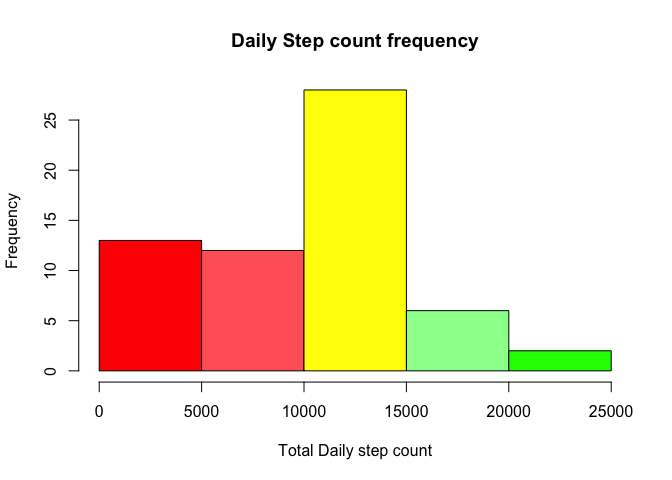

# Reproducible Research: Peer Assessment 1

## Loading and preprocessing the data


```r
wd <- setwd("/Users/bdolimier/persodev/RepData_PeerAssessment1")
acti <- read.csv("activity.csv" , header=TRUE, sep = ",", na.strings = "NA")
acti[is.na(acti)] <- 0
```

## What is mean total number of steps taken per day?


```r
tot <- colSums(acti[1], na.rm = TRUE, dims = 1)
nbDays <- sum(!duplicated(acti[2]))
avg <- tot / nbDays
```
### Total number of steps, average per day:

```r
print(tot)
```

 steps 
570608 

```r
print(avg)
```

  steps 
9354.23 

### Daily Steps histogram:

```r
colors = c("red" , "#ff6666", "yellow", "#66aa66" , "#00ff99" ) 
ag <- aggregate(acti$steps, by=list(acti$date), FUN=sum)[2]
hist( ag$x , col=colors , main= "Daily Step count frequency" , xlab="Total Daily step count")
```

 

## What is the average daily activity pattern?

```r
intAg <- aggregate(acti$steps, by=list(acti$interval), FUN=mean)

plot( intAg$x, type="l", ylim=range(intAg$Group.1/12), axes=F, ann=T, xlab="Hour",
   ylab="Steps", cex.lab=1, lwd=2)

box(lwd=1)
title("Daily Step pattern", sub = "by 5 minutes interval",
      cex.main = 1.5,   font.main= 4, col.main= "blue",
      cex.sub = .8, font.sub = 4, col.sub = "black")


hlabelScale<-c(0:24)*12
hlabelHour <- c(0:24)
text( hlabelScale+3 , -13 , srt=0, adj=1,
          labels=hlabelHour,
          xpd=T, cex=0.9)

vlabelScale<-c(0:18)*10
vlabelHour <- c(0:18)*10
text( -12 , vlabelScale , srt=0, adj=1,
          labels=vlabelHour,
          xpd=T, cex=0.9)
```

 


## Imputing missing values


## Are there differences in activity patterns between weekdays and weekends?
